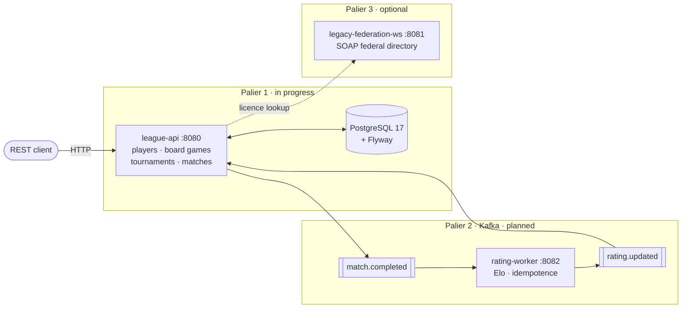

# Meeple League

A REST API for running board-game leagues: players, games, tournaments, matches and results.

> **Work in progress.** A deliberate practice project, built one layer at a time.
> Palier 1 (the REST API) is underway; the asynchronous and SOAP tiers come later.

## Architecture



## Stack

Java 21 · Spring Boot 4.1 · Spring Data JPA · Flyway · PostgreSQL 17 · Testcontainers

## What works today

- **Players** and **board games**: full CRUD under `/api/v1/players` and `/api/v1/boardgames`,
  paginated listing, bean validation, case-insensitive uniqueness enforced in the database.
- **Errors**: every response follows RFC 9457 `ProblemDetail`, carrying a stable `code`
  and an `errorId` that matches a log line — including the ones Spring raises before the
  controller is reached.
- **Schema**: Flyway migrations only, `ddl-auto: validate`, collation pinned to ICU.
- **Tests**: 55 integration tests driving the real stack against Postgres in Testcontainers.

## Run it

```bash
docker compose up -d          # Postgres 17 on :5432
./mvnw spring-boot:run        # API on :8080
curl localhost:8080/actuator/health
```

```bash
./mvnw test                   # needs a Docker daemon (Testcontainers)
```

## Roadmap

**Palier 1 — league-api**

- [x] 1.1 Project setup, Flyway, health endpoint
- [x] 1.2 Players and board games (CRUD, validation, RFC 9457 errors)
- [ ] 1.3 Tournaments and registrations (state machine, capacity rules)
- [ ] 1.4 Matches and results (optimistic locking)
- [ ] 1.5 End-to-end scenario, documentation, `v0.1`

**Palier 2 — asynchronous**

- [ ] Kafka, `rating-worker`, Elo, idempotence, outbox

**Palier 3 — à la carte**

- [ ] Dead-letter topic · SOAP federation client · Jenkins + SonarQube · ADRs
